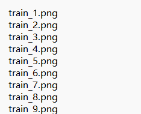
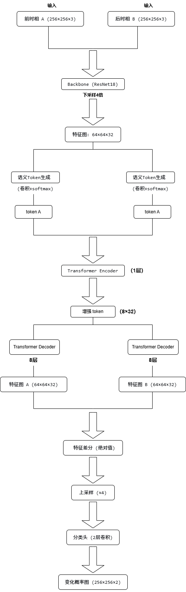
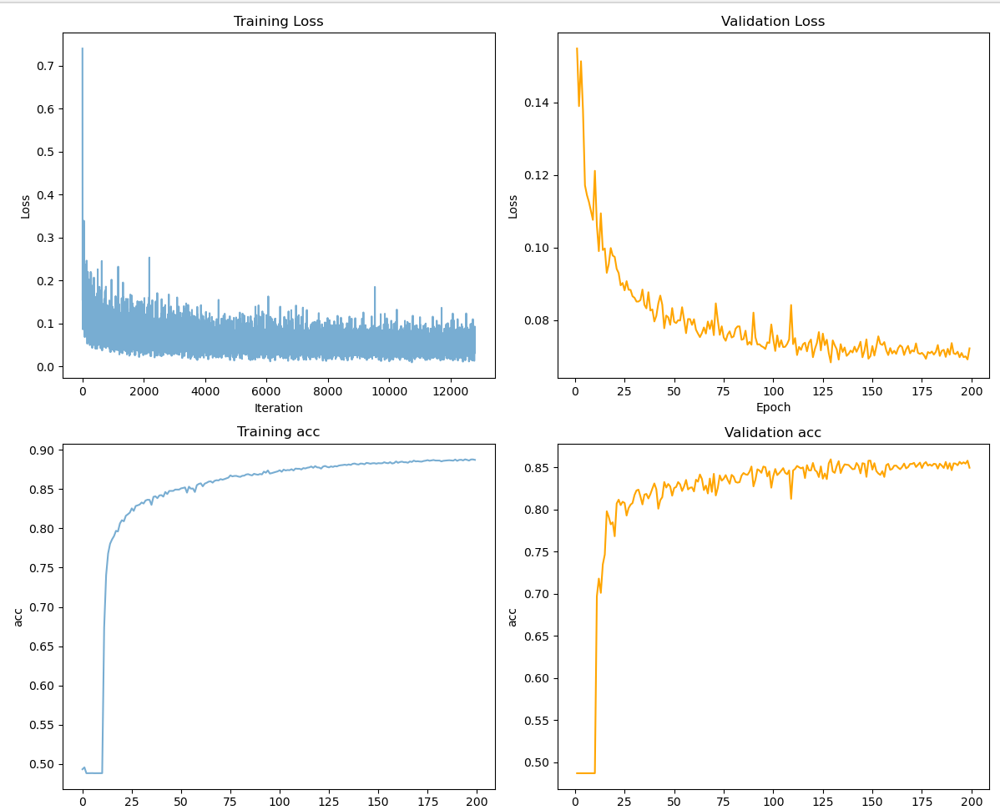
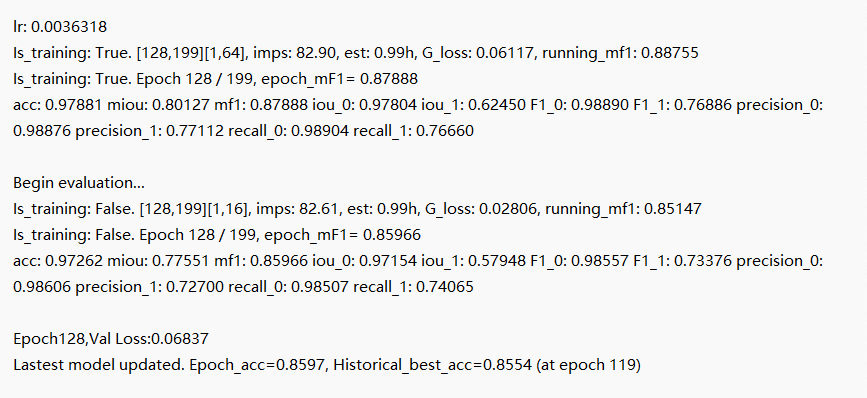
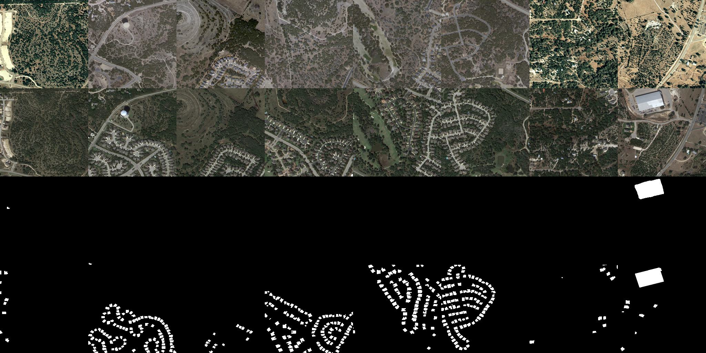
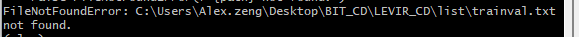
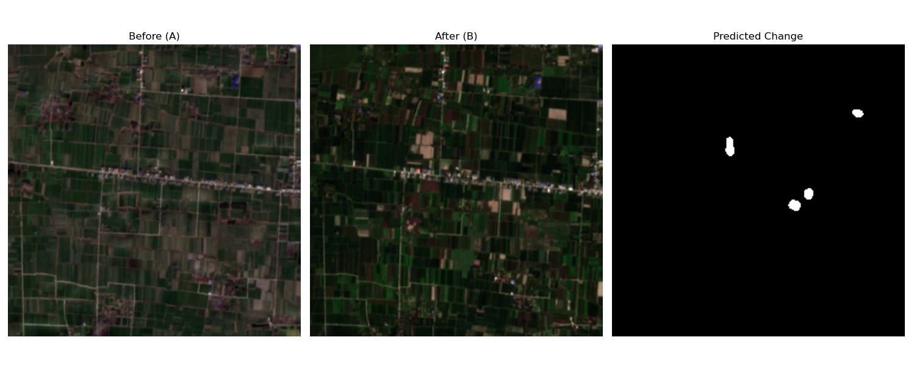
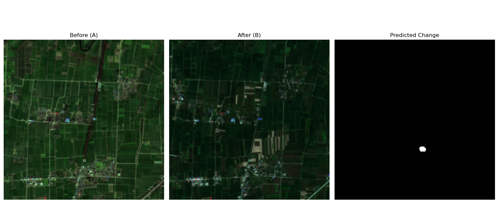
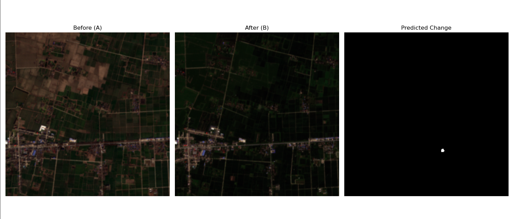

# 基于BIT_CD的遥感影像变化检测

## 项目简介

本项目基于BIT_CD模型，在LEVIR-CD数据集上训练，用于遥感影像的变化检测。后续尝试迁移到Sentinel-2影像。

## 需求

```
Python 3.12
pytorch 2.6.0
torchvision 0.21.0
einops  0.8.1
```

## 数据集

**1、LEVIR_CD**
- 训练集：LEVIR-CD（建筑变化检测数据集），格式如下图所示：<br>


- 数据格式：
```
需改变成如下数据结构：
├─A
├─B
├─label
└─list
```

`A`: t1期图像;

`B`:t2期图像;

`label`: 标注地图;

`list`: 包含train.txt, val.txt and test.txt，每个文件记录变化检测数据集中的图像名称（XXX.png）。

如下图所示：<br>


**2、sentinel-2影像（迁移测试）**
- 自行下载两期同一地区的Sentinel-2 L2A影像（我下载的是2025/02/07和2025/08/16）。
- 预处理：合成 RGB 三波段（B04,B03,B02），裁剪为 256×256 切片，与训练数据相同尺寸。
- 数值范围：原始反射率（DN/10000）为 0.1435~0.4428，通过线性拉伸到 [0,1]，再标准化到 [-1,1]。


## 模型结构

模型采用BIT_Transformer,基于ResNet18作为backbone，引入Transformer编码器-解码器结构提取语义token，最终通过特征差分和上采样得到变化图。

**数据流**：
- 输入：两幅256*256 RGB影像。
- backbone输出：32通道 64*64 特征图。
- 语义token：4个token，每个32维。
- Transformer处理后，特征图上采样至256*256。
- 分类头输出2通道变化概率图。



## 训练

运行命令`sh scripts/run_cd.sh`
<br>
训练命令：
```bash
gpus=0
checkpoint_root=checkpoints
data_name=LEVIR

img_size=256
batch_size=8
lr=0.01
max_epochs=200
net_G=base_transformer_pos_s4_dd8    # 变化检测网络
#base_resnet18
#base_transformer_pos_s4_dd8
#base_transformer_pos_s4_dd8_dedim8
lr_policy=linear

split=trainval
split_val=test
project_name=CD_${net_G}_${data_name}_b${batch_size}_lr${lr}_${split}_${split_val}_${max_epochs}_${lr_policy}

python main_cd.py --img_size ${img_size} --checkpoint_root ${checkpoint_root} --lr_policy ${lr_policy} --split ${split} --split_val ${split_val} --net_G ${net_G} --gpu_ids ${gpus} --max_epochs ${max_epochs} --project_name ${project_name} --batch_size ${batch_size} --data_name ${data_name}  --lr ${lr}
```

**主要参数：**

- batch_size:8
- max_epochs:200
- lr:0.001

**训练/验证损失曲线和准确度曲线：**


## 训练好的权重



从中可以看出验证集精度：
- 整体精度 (OA): 97.26%
- 平均交并比 (mIoU): 77.55%
- 变化类 IoU: 57.95%
- 变化类 F1: 73.38%

## 测试与可视化

运行命令`sh scripts/eval.sh`
<br>
测试命令：
```bash
gpus=0

data_name=LEVIR
net_G=base_transformer_pos_s4_dd8    
split=test
project_name=CD_base_transformer_pos_s4_dd8_LEVIR_b8_lr0.01_trainval_test_200_linear    # 训练部分生成的project_name
checkpoint_name=best_ckpt.pt

python eval_cd.py --split ${split} --net_G ${net_G} --checkpoint_name ${checkpoint_name} --gpu_ids ${gpus} --project_name ${project_name} --data_name ${data_name}
```

训练结束后，使用训练好的模型进行测试，结果如图所示：


## 训练过程中遇到的问题及解决方案

1、
<br>
出现该问题是因为在训练传入参数的过程中，有一行“split=trainval”，所以trainval.txt文本文件需要自己手动创建。

2、`ModuleNotFoundError: No module named ‘torchvision.models.utils’`<br>
这个是因为我们的torch版本比较高（高于1.6），所以报错了，需要将`resnet.py`中的报错语句
`from torchvision.models.utils import load_state_dict_from_url`改成`from torch.hub import load_state_dict_from_url`
就可以了。

## 迁移到sentinel-2影像

**目标：测试模型在真实 Sentinel-2 影像上的泛化能力（植被/水体变化场景）**
运行`test_sentinel-2.py`，结果：





可以看出模型未能有效检测出植被变化。原因可能包括：
- 训练数据（LEVIR）主要为建筑物变化，而测试数据以植被/水体变化为主，领域差异显著。
- 模型未见过植被变化模式，导致无法捕捉相关特征。

**下一步改进方向**
- 收集包含植被变化的数据集（如SECOND、HRSCD）进行微调。
- 使用多波段（如包含近红外）重新训练模型，提升对植被的感知能力。

## 项目总结 ##
- 成功复现BIT_CD模型，在LEVIR上取得较好性能。
- 完成了模型在真实哨兵2影像上的迁移实验，发现领域差异是影响泛化的重要因素。

## 参考
- https://github.com/justchenhao/BIT_CD

