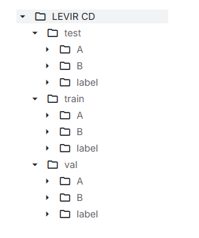

# 基于BIT_CD的遥感影像变化检测

## 项目简介

本项目基于BIT_CD模型，在LEVIR-CD数据集上训练，用于遥感影像的变化检测。后续尝试迁移到Sentinel-2影像

## 环境配置
-------

## 数据集

- 训练集：LEVIR-CD（建筑变化检测数据集），格式如下图所示：<br>


- 数据格式：
```
需改变成如下数据结构：
├─A
├─B
├─label
└─list
```

`A`: t1期图像;

`B`:t2期图像;

`label`: 标注地图;

`list`: 包含train.txt, val.txt and test.txt，每个文件记录变化检测数据集中的图像名称（XXX.png）。

如下图所示：<br>
图二

## 模型结构

图三

## 训练好的权重

- 最佳模型：`checkpoints/best_ckpt.pt`

```
- 验证集精度：
-acc: 0.97312
-miou: 0.77472
-mf1: 0.85894
-iou_0（未变化区域）: 0.97209
-iou_1（变化区域）: 0.57734
-F1_0: 0.98585
-F1_1: 0.73204
-precision_0: 0.98503
-precision_1: 0.74374
-recall_0: 0.98667
-recall_1: 0.72070 
```


